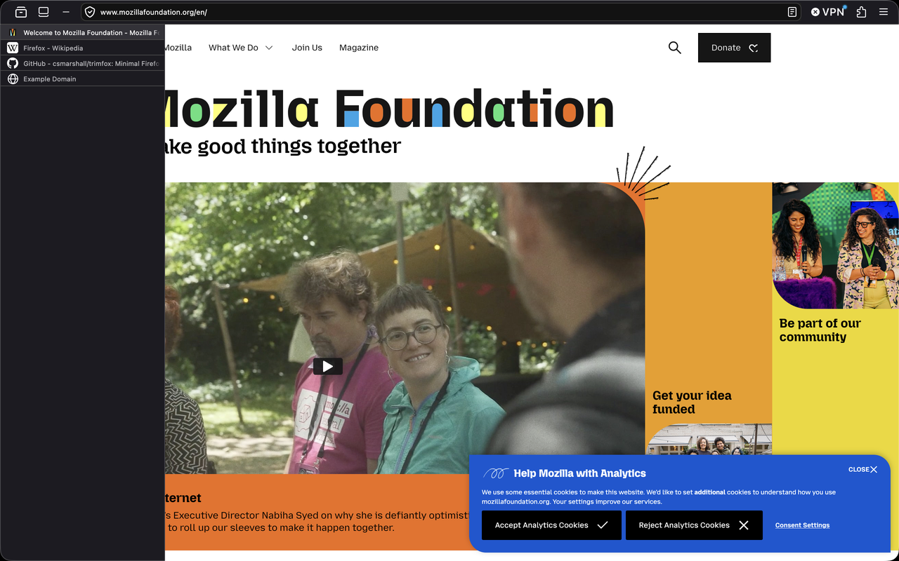
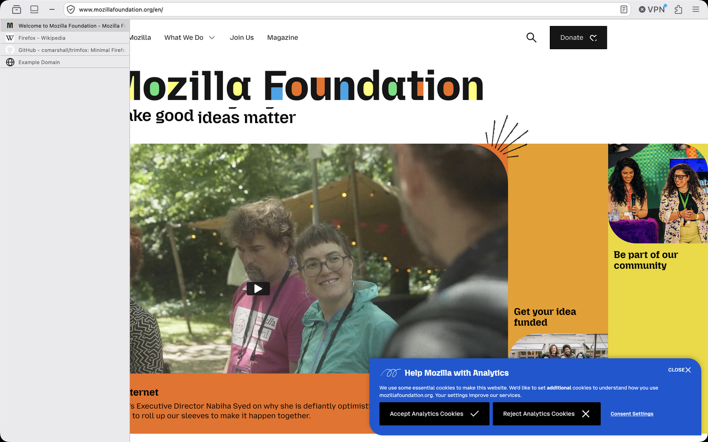
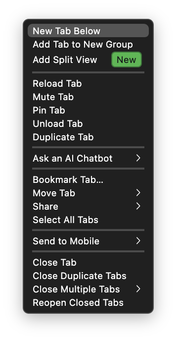
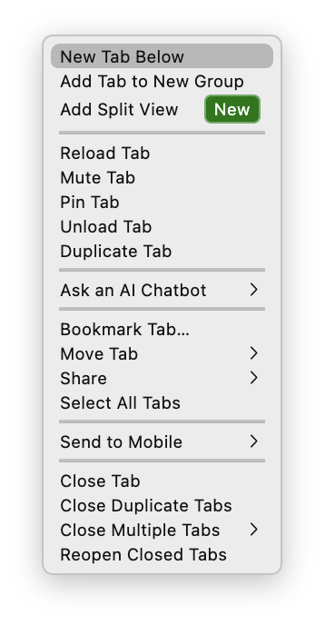
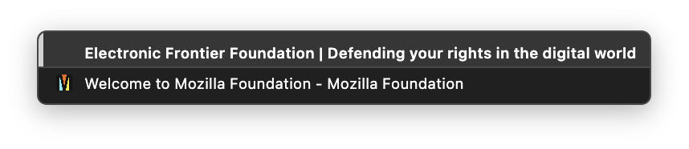
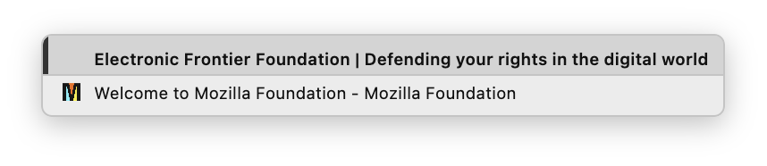

<h1 align="center">
  
</h1>

<p align="center">
  
</p>

<p align="center">
  <a href="https://opensource.org/licenses/MIT"></a>
  <a href="https://buymeacoffee.com/cs_marshall"></a>
  <a href="https://github.com/sponsors/csmarshall"></a>
</p>

A minimal Firefox `userChrome` setup built around **native vertical tabs** — no
Tree Style Tab, no sidebar extension, just the browser's own chrome restyled to
get out of the way.

The headline is the tab strip (Firefox's own native sidebar, restyled): collapsed, it's a skinny ~14px column of separator
lines that just tells you how many tabs are open; hover it and it expands to
readable labels. No favicons when collapsed, no pills, no close buttons, no
new-tab button, no hover-preview cards, no launcher clutter.

It's called *trimfox* because that's the point — trim everything that isn't a tab.

> **Heads up — this is opinionated.** trimfox collapses Back + Forward into a *single*,
> history-aware nav button (the old unified-back/forward look): a **‹** chevron when only
> back is available, a **›** when only forward is, a **⌄** down-chevron when both are (a
> hint the history menu is a right-click away), and a **–** dash when there's nowhere to go
> yet (a fresh tab, no history either way). Left-click navigates; the other direction
> and full history are on **right-click** (or the keyboard — `Cmd+[` / `Cmd+]`). If you rely
> on always-visible **separate Back and Forward buttons**, or you don't reach for
> keyboard/right-click navigation, trimfox probably isn't for you.

## Screenshots

trimfox follows the OS light/dark theme — everything below is shown in both.

### The tab strip

The headline: collapsed, it's a skinny column of separator lines — just a live tab count;
hover and it expands to full labels. Dark on top, light beneath.

<p align="center"><b>Expanded</b> (on hover) &nbsp;·&nbsp; <b>Collapsed</b></p>
<div align="center">
  <table align="center">
    <tr>
      <td></td>
      <td></td>
    </tr>
    <tr>
      <td></td>
      <td></td>
    </tr>
  </table>
</div>

### Themed menus

Even the right-click menus are skinned — trimfox forces XUL menus precisely because native
macOS menus can't be CSS-themed, so they match the chrome instead of popping up as stock
system menus. Dark and light in each pair.

<p align="center"><b>Tab right-click menu</b></p>
<div align="center">
  <table align="center">
    <tr>
      <td></td>
      <td></td>
    </tr>
  </table>
</div>

<p align="center"><b>Back/forward history menu</b> (off the unified nav button)</p>
<div align="center">
  <table align="center">
    <tr>
      <td></td>
      <td></td>
    </tr>
  </table>
</div>

## Requirements

- **Firefox 136+** (native vertical tabs); developed and verified on **152**.
- **macOS.** Built and tuned on macOS only — see [Platform support](#platform-support).
- A swappable palette (see [Palette](#palette)): default is neutral grayscale,
  zero-blue, with **dark + light** that auto-follows macOS Appearance. Preview the
  default light/dark in `palette.html`.

## Firefox compatibility — including "Nova"

Built and tuned on **Firefox 152**, and **already compatible with Firefox's 2026
["Nova" redesign](https://blog.mozilla.org/en/firefox/new-firefox-design/)** — on purpose.
A companion tool, **[trimfox-drift](https://github.com/csmarshall/trimfox-drift)**, diffed
trimfox's Firefox dependencies against a Nova Nightly (154) build and flagged the three
chrome vars Nova removes that trimfox relied on. Those were fixed pre-emptively with `var()`
fallbacks ([#33](https://github.com/csmarshall/trimfox/issues/33),
[`f555f9b`](https://github.com/csmarshall/trimfox/commit/f555f9b)) — so nothing changes on
152, and — hopefully — far less should break when Nova lands. Nova is still in Nightly and
will keep changing, so this is a cautiously-optimistic head start, not a guarantee.

## Install

**Prefer a single download?** Grab the
**[latest release zip](https://github.com/csmarshall/trimfox/releases/latest)**, unzip it,
and follow the `QUICKSTART.txt` inside (it's just `./install.sh`). No git, no command-line
know-how required beyond running one script.

Or clone it:

```sh
git clone https://github.com/csmarshall/trimfox.git
cd trimfox
./install.sh            # auto-detects your default profile
# or target one explicitly / preview first:
./install.sh -p "/path/to/profile"
./install.sh -n         # dry run
```

The installer copies `chrome/` and `user.js` into your profile, **backing up**
anything it replaces (`<name>.bak-<timestamp>`). Then **fully quit Firefox**
(Cmd+Q / close all windows) and relaunch — `userChrome.css` and `user.js` only
load at startup.

**Already have a `user.js`?** trimfox ships its own and **replaces** yours (your old one is
backed up to `user.js.bak-*`). Keep your own prefs in **`user-overrides.js`** (gitignored) — the
installer seeds it from `user-overrides.example.js`, appends it *after* trimfox's prefs
so yours win, and preserves it across updates. Every pref trimfox sets, with its Firefox
default, is in **[SETTINGS.md](SETTINGS.md)**. (That's the *prefs* layer; colors and dials
have a separate override file — `chrome/user-overrides.css`, covered under [Palette](#palette).)

To revert: restore the `.bak-*` files (or delete `chrome/`, `user.js`, and your
`user-overrides.*`) and restart. If you installed the error-page accent, run
`chrome/autoconfig/install-neterror-accent.sh -u` first.

### After install — two one-time steps

1. **Theme → "System theme — auto"** (`about:addons` → Themes) so light/dark
   follows the OS. The Add-ons Manager owns the active theme, so you may need to
   switch it once even though `user.js` sets the pref (toggle to another theme and
   back if it doesn't take).
2. **Sidebar width** — drag the expanded sidebar edge to your taste (~240px) once;
   Firefox persists it.

### Troubleshooting: chrome is themed but the tab strip is missing

If the URL bar / toolbar are clearly restyled but there's **no vertical-tab strip
on the left**, the sidebar *panel* is closed on that profile — and trimfox hides
the sidebar toggle button, so there's no obvious way to reopen it. **Open the
sidebar once** via **View → Sidebar** (macOS menu bar), or open any panel (e.g.
History) — the tab strip appears and **stays** after you close the panel. You only
need to do this once per profile.

(If the chrome *isn't* themed either, `userChrome.css` didn't load: confirm
`toolkit.legacyUserProfileCustomizations.stylesheets` is `true`, that `chrome/` +
`user.js` landed in the **running** profile — `about:support` → Profile Directory —
and that you fully **Cmd+Q**'d before relaunching.)

### Optional — skin the error pages too

CSS already reaches essentially the whole browser — chrome, toolbars, menus, the urlbar,
every in-content `about:` page. There's exactly one surface it can't: error pages
(`about:neterror`, `about:certerror`, `about:blocked`, `about:httpsonlyerror`) load in a
privileged context that never injects `userContent.css`. If you want the *entire*
interface — error pages included — in the palette, that's what
`chrome/autoconfig/install-neterror-accent.sh` is for. Everyone else can skip this;
trimfox is already fully themed without it.

```sh
cd chrome/autoconfig
./install-neterror-accent.sh            # install
./install-neterror-accent.sh -u         # uninstall
./install-neterror-accent.sh            # re-run after any Firefox update (see below)
```

It registers a global AutoConfig `USER_SHEET` — the only style origin privileged error
pages honor — so it writes two files *into* the `Firefox.app` bundle and needs
`general.config.sandbox_enabled=false`. Two trade-offs before opting in:

- **Sandbox off.** AutoConfig can't run with the config sandbox enabled, so installing
  flips `general.config.sandbox_enabled` to `false` for as long as it's installed. `-u`
  removes both files and restores the default.
- **Lives in the app bundle, so Firefox updates wipe it.** Both files sit under
  `Firefox.app/Contents/Resources/`, overwritten on every update — re-running the script
  (idempotent) reapplies it.

If Firefox isn't at `/Applications/Firefox.app`, pass `-a PATH`.

> Note: the error-page gray is hardcoded in the script, so it won't follow a palette swap
> (e.g. to `firefox.css`'s blue accent) — error pages stay gray. Edit the hex in the
> script's `.cfg` block to match a different palette.

## What's in here

```
chrome/
  userChrome.css        the bulk — vertical-tab reskin + urlbar/findbar tweaks
  userContent.css       in-content page tweaks
  refined-findbar/      compact find bar
  autoconfig/           optional: AutoConfig installer for error-page accent color
user.js                 prefs that enable/shape native vertical tabs (see below)
install.sh              copy-with-backup installer
reference/              how this was migrated off Tree Style Tab (not installed)
```

`user.js` is the behavioral half — it enables `sidebar.verticalTabs`, sets
collapse + instant expand-on-hover, kills the tab hover-preview card, etc. Every
pref is commented. `chrome/userChrome.css` is the visual half.

## Tweak catalog

Every change the theme makes, grouped by area. Selectors / `--tf-*` tokens are
noted where they're the handle you'd reach for. GitHub issue numbers in
parentheses point at the comment that documents the fix.

### Palette & color tokens (`--tf-*`)

The single source of truth. The **primitive tokens live in a swappable palette
file** (`chrome/palettes/grayscale.css` by default) imported at the top of
`chrome/userChrome.css`; userChrome maps those onto Firefox's own theme vars and
never hardcodes a color. Each palette carries a dark set **and** a
`@media (prefers-color-scheme: light)` set — see [Palette](#palette).

- **Surfaces** — `--tf-field` (inset URL/search boxes), `--tf-content` (page bg),
  `--tf-surface` (toolbar/sidebar/tab strip), `--tf-raised` (hover/selected),
  `--tf-select` (text + dropdown selection).
- **Accent** — `--tf-accent` / `-hover` / `-active` replace Firefox's teal on
  buttons, focus rings, checkboxes.
- **Text** — `--tf-text`, `--tf-text-dim`.
- **Lines & highlights** — `--tf-line` / `-inactive` (translucent separators),
  `--tf-line-solid` / `-inactive` (opaque form so an edge reads the same over the
  active highlight and dark tabs, #2), `--tf-highlight` / `-inactive` (active-tab
  fill).
- **Glyph & attention** — `--tf-glyph` (fixed glyph ink: nav dash, history accent
  bar, neutral container marker — bright on dark / dark on light); `--tf-attention`
  (download / update / media *attention* badges Firefox otherwise paints blue/
  green/teal — neutralized so grayscale stays zero-blue; blue in the firefox
  palette).
- **Structural (not a color, stays in userChrome)** — `--tf-sep-inset` (separator
  inline-start inset clearing the macOS frame, #2).
- **Theme-var mapping** — `--toolbar-bgcolor`, `--lwt-*`, `--sidebar-*`, the urlbar
  field backgrounds (`--toolbar-field-background-color[-focus]`, `--urlbar-box-*`),
  the `--color-accent-primary*` and `*-attention*` sets, the arrowpanel/menu
  surfaces (`--panel-background-color`, `--panel-border-color`,
  `--toolbar-background-color`, `--button-background-color-hover/-active`), and the
  urlbar-popup / autocomplete / chrome-selection highlight vars — all pointed at the
  tokens with `!important`. (These panel/field mappings close the "leak" class of
  bug — see [`docs/color-audit.md`](docs/color-audit.md).)
- Most lines/dividers gain a `:root:-moz-window-inactive` variant so they dim when
  the window loses focus. **Semantic colors are deliberately left unmapped** —
  security red, warning yellow, and container colors stay bold.

### Window & titlebar

- Remove the macOS native traffic-light buttons (`.titlebar-buttonbox` →
  `appearance: none`), hide the XUL `.titlebar-button` / `.titlebar-spacer`
  replacements, and shrink `.titlebar-buttonbox-container` to an 8px inset before
  Back. No window buttons at all — use Cmd+W / Cmd+Q / Cmd+M.

### Toolbar & nav buttons

- Re-icon Back/Forward with the devtools `play.svg`, flipping Back via
  `scaleX(-1)` (`#back-button` / `#forward-button`).
- Hide the bookmark star in the URL bar; Cmd+D still bookmarks (`#star-button-box`,
  #10).
- Hide the un-removable flexible space between Back/Forward and the URL bar
  (`#nav-bar #vertical-spacer`) — added flexible space to the right still works.
- Hide the sidebar toggle button (`#sidebar-button`) — expand-on-hover makes it
  redundant.

### Menus & fonts

- Chrome font is driven by two dials — **`--tf-font-family`** (`-apple-system`) +
  **`--tf-font-size`** (`7pt`, the 1.0× base) — set on `:root` and inherited (not a
  blunt `*`; popups get explicit `menupopup`/`panel` rules). Non-base sizes reproduce
  **Firefox's own proportional hierarchy** via `--tf-fs-*` tiers, toggled by
  **`--tf-fs-lift`** (`1` = full proportional, `0` = flat-ish middle path). Ratios &
  the regeneration recipe live in [`docs/font-hierarchy.md`](docs/font-hierarchy.md).
- Theme the (now-XUL) context/popup menus: `--tf-surface` bg, `--tf-select` hover,
  themed text/separators, trimmed padding, `min-height: 0`, 7pt (requires
  `widget.macos.native-context-menus = false`). The tight padding is scoped to the
  history popup via `:has(.unified-nav-current)` so context menus keep a comfortable
  inset.
- **Back/forward history menu** reskinned as the vertical **tab strip** (requires
  `widget.macos.native-anchored-menus = false`, which also resolves #6): current
  page = active-tab highlight + a `--tf-glyph` left accent bar; back/forward =
  inactive-tab rows; full-width separators (none under the last row); a favicon
  column; hover swaps the favicon for a themed arrowhead. Tune with the
  `--tf-hist-*` dials (see [Tuning knobs](#tuning-knobs)).
- Re-hide the searchmode-switcher placeholder glyph that the universal 7pt rule
  leaks (`.urlbar-visually-hidden`).

### URL bar

- Field background pinned to `--tf-field` for **resting, focus, and hover**
  (`--toolbar-field-background-color[-focus]`, the `--urlbar-box-background-color*`
  set) so the field stays dark regardless of the base theme — the focus background
  is otherwise unmapped and leaks a lighter gray on "System — auto". 7pt, readable
  `--tf-text` input incl. focused state; selection forced to `--tf-select` bg /
  white text (HTML-namespaced `input` selectors).
- Tab-style 1px border on `.urlbar-background` matching the tabs/sidebar; when
  results open, the border frames field + popup as one window (#11).
- **No-grow on focus**: pin the breakout-extend state back to the compact box
  using Firefox's own live vars (`--urlbar-width`, `--urlbar-height`,
  `--urlbar-toolbar-height`) so only the results panel drops below (#11).
- Hide the placeholder text, the "search with" one-offs, and the search-engine
  one-off row.
- `--urlbar-toolbar-height: 34px` — **not** a height lever; it only feeds the
  focus-centering `calc()`. Removing it breaks the focused-urlbar/results rendering
  (to actually slim the bar, lower `--urlbar-min-height` or use UI density).

### URL bar dropdown / results

- Force URLs/actions to `--tf-text-dim` gray (kills the teal accent), override
  link styling, and white text on the selected row (`--tf-select` bg).
- Compact results: trimmed block padding (with 6px breathing room under the last
  row, #11), dimmed icon fill, 7pt.
- Hide the redundant first row when it's a "search with" / "visit" item, and the
  title-separator + secondary text on row 0.
- **Kill the field↔results divider** (`--urlbarview-separator-color: transparent`)
  so the field and popup read as one seamless panel.
- **"Switch to Tab" chiclet**: themed pill (`--tf-raised` bg, `--tf-line-solid`
  border) with the tab glyph repainted via `mask` + `background-color: var(--tf-text)`
  — Firefox's `context-fill` wouldn't take our color (same quirk as the nav dash).

### Vertical-tabs reskin

- Native vertical tabs styled to the old Tree Style Tab look: compact **22px**
  rows (`--tab-min-height`), skinny **14px** collapsed strip
  (`--tab-collapsed-background-width`).
- Collapsed strip is constrained to the strip width and clipped so tabs don't
  overflow; favicons hidden **only** when collapsed (`display:none` so they
  reclaim width) → the strip becomes a stack of separator lines = a tab count.
- Expanded tabs get a 10px label inset to balance the right-side title fade.
- Flatten the tab "pill": no rounded background, margins, border, box-shadow, or
  the native inset `outline` (#3); square flush full-width rows.
- Hide tab close buttons (`display:none` so the label doesn't reflow on hover),
  the new-tab button / periphery, and the tab-list scrollbar.
- Auto-hide the entire sidebar when only one tab is open
  (`#sidebar-main:not(:has(.tabbrowser-tab ~ .tabbrowser-tab))`, live).
- `-moz-window-dragging: no-drag` so tabs read as draggable content.

### Tab separators & dividers

- Per-tab separator drawn as a 1px bottom **gradient** on `.tab-background`, inset
  from the inline-start by `--tf-sep-inset` so it clears the window frame (#2);
  opaque `--tf-line-solid` so it reads identically over active and inactive tabs.
- Active tab `.tab-background` clipped off the leftmost `--tf-sep-inset` px so the
  window-edge highlight always sits over dark background — identical left edge on
  every tab (#2).
- Unified full-width line under the toolbar via `#navigator-toolbox`
  `border-block-end` in `--tf-line-solid`.
- Kill the stray native `#tabbrowser-tabs::after` 1px line (#1).

### Sidebar & launcher

- Right divider: `#vertical-tabs` border when collapsed (constrained to strip
  width via `:has()`), `#sidebar-main` border when expanded.
- Hide the vestigial resize splitter `#sidebar-launcher-splitter` (drew a stray
  line at the top of the tab area, #1).
- Expand-on-hover flush fix: pull the overlay up 1px and draw the toolbar line as
  a box-shadow so it runs continuous (scoped to
  `#main-window[sidebar-expand-on-hover]`, #1).
- Hide the launcher icon strip without collapsing the sidebar: keep
  `.buttons-wrapper` in flow (it anchors the width) but clip to zero height /
  invisible / non-interactive, pinned to the collapsed-strip width.

### Tab states

- Active tab: flat `--tf-highlight` fill (Photon makes selected == sidebar bg,
  i.e. invisible) — `--tf-highlight-inactive` when unfocused.
- Muted tabs dimmed to `opacity: 0.5` (TST parity).
- **Loading indicator**: the native throbber (spinner/"hourglass") is hidden and
  replaced with an animated fill wash while a tab is `[busy]` — **vertical**
  (bottom→top) when collapsed, **left→right** when expanded. It's *indeterminate*
  (loops to hint "loading") because Firefox exposes only boolean `[busy]`/
  `[progress]` to CSS, not a load percentage — a real progress bar would need
  userChrome.js. Dials: `--tf-load-fill`, `--tf-load-opacity`, `--tf-load-speed`.

### Container-tab indicators (#12)

- The marker color is **dynamic** — Firefox's live `var(--identity-tab-color)`, so
  each container renders in its own color (Personal blue, Work orange, …). No
  hardcoded colors, except `toolbar`-colored containers (e.g. the Facebook Container
  add-on), which resolve to `currentColor` (white); those are pinned to `--tf-glyph`
  so they read on-theme instead of stark white (per `usercontextid`).
- **Two markers, one per mode** (so they never stack): a half-**pill** on the
  inline-start (left) edge, and the container **glyph** on the right (icon mapped
  per `usercontextid` — FF exposes no var for it). **Collapsed** shows the pill;
  **expanded** shows the glyph.
- Firefox's own native `.tab-context-line` is **hidden** (it duplicated our marker,
  and stayed white for `toolbar` containers).
- Both dim on blur. The collapsed pill is toggleable via
  `--tf-container-collapsed-flag` (`none` = clean strip).

### Pinned tabs (#13)

- Pins become **favicon-only squares** (`--tf-pin-size`, favicon
  `--tf-pin-favicon`) in a single horizontal **sliding row**: taken out of flow
  with `position:absolute` and placed by `:nth-child` step patterns →
  `--pin-col` / `--pin-row` → `left` offset (works around the unstyleable
  UA-widget shadow and missing `sibling-index()`).
- Labels / close button hidden; separators, borders and outline neutralized on
  pins; favicon centered both axes.
- Hover highlight (`--tf-select`, rounded) as you slide across; clean filled
  square on selection.
- Overflow fade: once pins exceed the viewport (~9th pin) the right edge is
  masked to signal "more, scroll right".
- The native pinned↔normal splitter re-rendered as a clean 1px full-width line
  (`#vertical-pinned-tabs-splitter`), and the gap above the first normal tab
  removed.
- Tunables: `--tf-pin-size`, `--tf-pin-favicon`, `--tf-pin-pitch`,
  `--tf-pins-per-row` (must match the `7n` patterns), `--tf-pin-row-inset`,
  `--tf-pin-area-width`.

### Drag-to-reorder (#14)

- Theme only (native FF vertical tabs already support drag-reorder): the faint
  native `.tab-drop-indicator` is re-rendered as a bold opaque `--tf-accent` bar
  with a glow. Container markers are `pointer-events:none` so they don't block the
  drag. (Mid-drag blanking, if seen, is a known upstream FF bug.)

### Findbar

- Compact find bar imported from `chrome/refined-findbar/findbar.css`.
- Collapse the findbar to zero height when not focused
  (`findbar:not(:focus-within)`).

### In-content pages (`chrome/userContent.css`)

- Dark `#1c1c1c` background on `about:blank`.
- On `about:` / `chrome:` pages: gray selection and the gray accent (the
  `--in-content-*` / `--color-accent-primary*` button, focus and form-control
  vars) replacing teal.
- Note: error pages (`about:neterror` etc.) can't be styled here — they use the
  optional AutoConfig USER_SHEET in `chrome/autoconfig/`.

### Prefs (`user.js`)

- **Enable the reskin**: `toolkit.legacyUserProfileCustomizations.stylesheets`,
  `sidebar.revamp`, `sidebar.verticalTabs`,
  `sidebar.revamp.round-content-area=false`.
- **Themeable XUL menus**: `widget.macos.native-context-menus=false` (right-click
  menus) and `widget.macos.native-anchored-menus=false` (urlbar dropdown +
  click-and-hold history menu — the latter resolves #6).
- **Color scheme follows the OS**: `browser.theme.toolbar-theme=2` /
  `content-theme=2` + `extensions.activeThemeID=default-theme@mozilla.org` (System
  — auto), so trimfox's light/dark palette tracks macOS Appearance — see
  [Light / dark](#light--dark-auto-follows-macos).
- **Behavior**: `sidebar.visibility="expand-on-hover"`, `sidebar.expandOnHover`,
  `sidebar.position_start` (left), animations off, and **instant** hover-expand
  (`...expand-on-hover.delay-duration-ms=0` / `duration-ms=0`). Empty
  `sidebar.main.tools` (launcher is CSS-hidden). `browser.tabs.inTitlebar=1` keeps the
  chrome in the title bar.
- **No hover-preview card**: `browser.tabs.hoverPreview.enabled` /
  `showThumbnails` off.
- **Compact layout**: `browser.uidensity=1`, `compactmode.show`, bookmarks toolbar
  `never`, keep window on last-tab close.
- **Content fonts**: `font.size.variable.x-western=12`, monospace `14` (chrome is
  forced to 7pt in CSS).
- **Live editing**: `devtools.chrome.enabled`, `devtools.debugger.remote-enabled`.
- **Optional personal block**: trimmed URL-bar suggestions, stripped new-tab page,
  restore previous session, and faster tooltips (`ui.tooltipDelay=300`).

## Tuning knobs

Colors come from the [palette](#palette). Everything else is driven by `--tf-*`
dials, each defined in a labeled `:root` block right above the feature it controls
in `chrome/userChrome.css`:

| Knob | Default | What it controls |
|------|---------|------------------|
| **Font** | | |
| `--tf-font-family` | `-apple-system` | chrome-wide typeface |
| `--tf-font-size` | `7pt` | chrome-wide base size (the 1.0× anchor; everything scales from it) |
| `--tf-fs-lift` | `1` | `1` = full proportional (FF's hierarchy), `0` = middle path, fractions blend |
| `--tf-fs-field` / `-md` / `-h` / … | `1.1×` … | per-tier `calc()` ratios (see [`docs/font-hierarchy.md`](docs/font-hierarchy.md)) |
| **Tab strip** | | |
| `--tab-min-height` | `22px` | row height |
| `--tab-collapsed-background-width` | `14px` | collapsed strip width |
| `--tf-sep-inset` | `1px` | tab-separator inline-start inset (clears the macOS frame) |
| **Pinned grid** (`#13`) | | |
| `--tf-pin-size` | `22px` | faviconized pin square |
| `--tf-pin-favicon` | `14px` | favicon inside the square |
| `--tf-pin-pitch` / `-pitch-n` | `24px` / `24` | pin-to-pin step (px + unitless) |
| `--tf-pin-area-width` | `230` | fallback grid width (auto-fit overrides via `@container`) |
| `--tf-pin-row-inset` | `4px` | left inset of pin #1 |
| **History menu** (tab-strip skin) | | |
| `--tf-hist-row-pad-block` / `-inline` | `2px` / `8px` | per-row padding |
| `--tf-hist-end-pad` | `6px` | extra pad at the menu's top/bottom rows |
| `--tf-hist-favicon` | `16px` | favicon column size |
| `--tf-hist-accent-width` / `-color` | `3px` / `--tf-glyph` | active-row left accent bar |
| **Loading indicator** | | |
| `--tf-load-fill` / `-opacity` / `-speed` | `--tf-accent` / `0.6` / `1.4s` | busy-tab fill wash |
| **Container markers** (`#12`) | | |
| `--tf-container-collapsed-flag` | `block` | `none` = hide the pill in the collapsed strip |

The dividers, separators, and container markers use `:-moz-window-inactive` so they
dim when the window loses focus, matching the rest of the themed chrome.

## Palette

**Prefer your own colors? Don't edit these files — set them in
[`user-overrides.css`](#personal-overrides--user-overridescss-survives-upgrades).** It loads
*after* the palette, so it's the standard, non-destructive way to pick or retune a palette
without touching committed CSS — and it survives `git pull`. Point it at a different shipped
palette with one `@import` (no need to change the `@import` below), or just override
individual tokens:

```css
/* chrome/user-overrides.css — loaded last, so plain declarations win (no !important) */
@import url('./palettes/tinted.css');   /* switch palette here, not in userChrome.css */
:root {
  --tf-hue: 260;  --tf-chroma: 0.03;    /* tune the tinted palette…            */
  /* --tf-accent: #6a7fb0; */           /* …or just override a token or two    */
}
```

The rest of this section describes trimfox's *shipped* palettes and how to change the
**default**. All colors are `--tf-*` tokens, and `userChrome.css` never hardcodes a color — it
maps Firefox's own theme variables onto the tokens, so a whole theme is just one
token set. The **primitive tokens live in a swappable palette file**, imported at
the top of `chrome/userChrome.css`:

```css
@import url('./palettes/grayscale.css');   /* ← swap this one line */
```

Each file in **`chrome/palettes/`** defines the token set for **both dark and
light**, so the scheme follows the OS automatically (see below):

| file | look |
|------|------|
| `grayscale.css` *(default — stock)* | neutral grayscale, zero-blue — dark + inverted light. The exact reference look. |
| `firefox.css` | trimfox layout with Firefox's own default chrome colors + blue accent |
| `tinted.css` *(adjustable)* | parametric one-hue tint — derives the whole ramp from `--tf-hue` + `--tf-chroma` (see below) |

Token vocabulary: `field`, `content`, `surface`, `raised`, `select`, `accent`
(+ `-hover`/`-active`), `text`, `text-dim`, `line` (+ `-solid`/`-inactive`),
`highlight`, `glyph`. The accent (`--tf-accent`) replaces Firefox's default teal
on buttons, focus rings and checkboxes — in the chrome, on `about:` pages
(`userContent.css`), and on privileged error pages (`chrome/autoconfig/`).

**Interactive tools** — self-contained HTML; open locally, or try them live on
GitHub Pages:

- **[Tint picker](https://csmarshall.github.io/trimfox/tint-picker.html)** (`tint-picker.html`) —
  pick a base color, or dial hue + tint strength, and compare your palette against
  *stock* grayscale side by side; copy the two `tinted.css` values.
- **[Palette explorer](https://csmarshall.github.io/trimfox/palette.html)** (`palette.html`) —
  a 4-way preview (trimfox dark/light, Firefox-default dark/light) that re-colors a
  live browser-chrome mockup and a full swatch table.

**Tinted palette (`palettes/tinted.css`) — adjustable.** An opt-in alternative to
the stock grayscale. Two knobs at the top drive the whole theme, keeping trimfox's
exact lightness/contrast ramp and just tinting it:

| knob | range | meaning |
|------|-------|---------|
| `--tf-hue` | 0–360 | which color the tint leans toward |
| `--tf-chroma` | 0–~0.05 | how much color (`0` = neutral) |

`--tf-chroma: 0` reproduces grayscale — for the *exact* stock look, use
`grayscale.css` itself. Swap the `@import` to `palettes/tinted.css` and set the two
values. Example hues: **slate `260`**, **terracotta `40`**, **forest `150`**,
**plum `330`** (chroma ~0.025–0.035).

### Personal overrides — `user-overrides.css` (survives upgrades)

**Don't edit the committed files to customize.** trimfox loads
**`chrome/user-overrides.css`** *last* — a gitignored, per-user file where you set any
`--tf-*` color or dial with a **plain declaration (no `!important`)** and it wins as if it
were the shipped default. Because it's untracked, `git pull` (including the eventual
Firefox **Nova** re-map) updates the theme underneath while your settings persist — no
hand-merging.

```sh
cp chrome/user-overrides.example.css chrome/user-overrides.css   # install.sh does this for you
```

Then uncomment what you want:

```css
:root {
  --tf-font-size: 9pt;      /* bigger chrome text     */
  --tf-anim:      120ms;    /* add find-bar motion    */
  --tf-accent:    #6a7fb0;  /* a different accent     */
}
```

Every knob lives in **`chrome/dials.css`** (structural dials) and the palette
(`palettes/*.css`, colors) — both loaded before your overrides. The `--tf-*` names are
trimfox's stable API: Firefox's own var/selector names churn under it, yours don't.

### Light / dark (auto-follows macOS)

Each palette carries a dark set plus an `@media (prefers-color-scheme: light)`
set, so trimfox switches with your **macOS Appearance** (System Settings →
Appearance). No restart once it's wired — flip the OS and the chrome follows.

**One-time setup — Firefox's chrome scheme is driven by its active *theme*, not by
macOS directly.** A built-in **Dark** or **Light** theme hardcodes the scheme and
*pins* the palette; you need **System theme — auto** so the chrome tracks the OS.
trimfox's `user.js` sets `browser.theme.toolbar-theme` / `content-theme` to `2`
(auto) and `extensions.activeThemeID` to `default-theme@mozilla.org`, but the
**Add-ons Manager owns the active theme and often wins over the pref**. If light
mode doesn't engage:

> **☰ → Add-ons and themes → Themes**, and switch to **"System theme — auto".**
> If it's already selected but stuck, toggle to any other theme and back — that
> forces the Add-ons Manager to re-apply *auto* (the pref alone may not take).

(trimfox overrides every chrome color regardless, so the theme choice only
controls *which* light/dark palette engages — not the look otherwise.)

> **Note:** `--tf-glyph` can't reach into `data:` SVG icons (CSS `var()` doesn't
> resolve inside a data URI), so the no-history nav-button dash bakes its color
> in. It ships a light-gray dash plus a dark-gray copy swapped in under
> `@media (prefers-color-scheme: light)` — so a *custom* palette that flips
> light/dark differently would need the same one-line media override.

## docs/ (maintainer notes)

Reverse-engineering method and hard-won gotchas from building trimfox — read
these before a tricky chrome change:

- **[`docs/theming-playbook.md`](docs/theming-playbook.md)** — how to reverse-
  engineer Firefox chrome: reading FF's source out of `omni.ja`, live Browser-
  Toolbox probes, piercing UA shadow DOM, SVG-icon theming, live-reactive
  `:has()` selectors, condensed case studies (pinned grid, URL bar, menus, nav
  button, drag-reorder), and a gotchas quick-reference.
- **[`docs/color-audit.md`](docs/color-audit.md)** — when a chrome surface is the
  wrong shade: the 5-minute procedure to find the unmapped Firefox variable and
  bind it to a `--tf-*` token.

## reference/

`reference/` documents the migration *off* Tree Style Tab — the exported TST
user stylesheet and config that the native setup was modeled on. It's a record,
not something you install.

## Platform support

Built and tuned on **macOS only** (Firefox 152). It likely works on Windows and
Linux with tweaks, but a couple of things are macOS-specific and untested
elsewhere:

- layout/spacing assumes the macOS titlebar and traffic-light window controls;
- `install.sh` profile auto-detection includes the Linux path but is only
  verified on macOS.

**PRs for other platforms are very welcome** — with one hard rule: **they must not
change the look or layout on macOS.** Gate any platform-specific differences behind
the right selectors (e.g. `@media (-moz-platform: windows)` /
`:root[platform="linux"]`) or separate files, so the macOS default stays exactly
as-is.

### 🙋 Volunteers wanted (Linux / Windows testing)

trimfox is built and tuned on macOS only, so a handful of things genuinely need
eyes on other platforms. Anything that needs other-OS or other-hardware testing is
tagged **[`user-testing`](https://github.com/csmarshall/trimfox/labels/user-testing)**
— currently:

- **Validate the overall look on Linux** (issue #8) and **Windows** (#9).
- **Confirm the pinned-tab row's two-finger / horizontal scroll** works off macOS
  (#17). On macOS the pinned row is a single sliding row; elsewhere it wraps to
  rows as a fallback — if scroll works on your platform, we can switch it to slide.

You don't need to write a fix — just run it, try the thing, and report back (a
screenshot or even a plain "works / doesn't" is genuinely useful). Grab a
[`user-testing` issue](https://github.com/csmarshall/trimfox/labels/user-testing)
and comment.

**Porting or sending a PR?** See **[CONTRIBUTING.md](CONTRIBUTING.md)** — how to gate
per-OS changes with `@media (-moz-platform: …)`, the "don't change the macOS look" rule,
and the **before/after screenshots every visual PR needs**. Firefox is only run/tested
on macOS here, so a platform PR can't be reviewed without them.

## Acknowledgements

trimfox builds on other people's work:

- **[refined-findbar](https://github.com/ravindUwU/firefox-refined-findbar)** by ravindUwU
  (MIT) — the compact find bar in `chrome/refined-findbar/findbar.css` is adapted from it;
  the MIT notice is retained in that file.
- **[Tree Style Tab](https://github.com/piroor/treestyletab)** by Piro — trimfox reproduces
  its vertical-tab look using Firefox's own native vertical tabs (this profile was migrated
  *off* TST; see `reference/`). Inspiration, not code.
- **The [r/FirefoxCSS](https://www.reddit.com/r/FirefoxCSS/) community** — for the userChrome
  techniques this builds on, including hiding the macOS traffic-light window controls.
- **Logo** — the running-fox mark started as a generation from **[Google Gemini](https://gemini.google.com)**,
  then took a fair bit of hand-work to ship: chroma-keyed off a red background, indexed to trimfox's own
  grayscale palette, and given a keyline outline so it holds up on both light and dark backgrounds.

**How this was built.** trimfox began as years of hand-tuned Firefox `about:config` tweaks
and userChrome hacks — a personal setup refined by hand over a long time. More recently, AI
(Anthropic's Claude) helped clean it up, document it, extend it, and package it for release.
The foundation is human, built over years of fine-tuning; the AI accelerated the polish.

## License

MIT — see [LICENSE](LICENSE).
